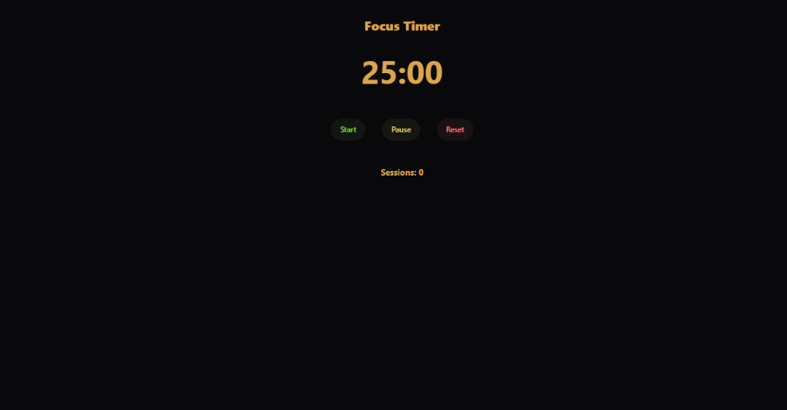

`
# ⏱️ Focus Timer

A clean and minimal **Pomodoro-style focus timer** built with **Next.js, React, Tailwind CSS, and daisyUI**.

The application provides a simple 25-minute focus timer with start, pause, and reset controls, while tracking the number of completed focus sessions.

## 🌐 Live Demo

[View Live Demo](https://a-h-m-e-d-z-a-h-e-r.github.io/Focus-Timer/)

## ✨ Features

* ⏱️ 25-minute focus timer
* ▶️ Start timer
* ⏸️ Pause timer
* 🔄 Reset timer
* 📊 Track completed focus sessions
* ⏲️ Real-time countdown
* 🎨 Clean and minimal interface
* 🌙 Custom dark theme
* 📱 Responsive layout
* ⚡ Lightweight and dependency-free

## 🛠️ Tech Stack

* **Next.js 16**
* **React 19**
* **TypeScript**
* **Tailwind CSS 4**
* **daisyUI 5**
* **ESLint**
* **React Compiler**

## ⏱️ Timer Logic

The timer starts with a **25-minute countdown (1500 seconds)**.

The application uses React state to manage:

* Current remaining time
* Timer running state
* Completed sessions

The countdown is updated every second using `setInterval`.

When the timer reaches zero:

1. The timer automatically stops.
2. The completed session counter increases by one.
3. The timer remains at zero until it is reset.

## 🧩 Project Structure

```text
focus-timer/
├── app/
│   ├── globals.css
│   ├── layout.tsx
│   └── page.tsx
│
├── package.json
├── tsconfig.json
├── next.config.ts
└── postcss.config.mjs
````

### Architecture

* **`app/page.tsx`** — Main timer interface and application logic.
* **`app/globals.css`** — Tailwind CSS and daisyUI configuration.
* **`app/layout.tsx`** — Root layout, fonts, theme, and metadata.
* **`package.json`** — Project dependencies and scripts.

## 🎨 Interface

The application uses **daisyUI's Luxury theme** with Tailwind CSS utility classes.

The interface includes:

* Large countdown display
* Start, Pause, and Reset controls
* Completed sessions counter
* Minimal centered layout
* Responsive spacing and typography

## 📱 Responsive Design

The interface is built with Tailwind CSS utility classes and adapts to different screen sizes, including:

* Desktop
* Tablet
* Mobile

## 🖼️ Screenshot



## 🎯 Project Goal

This project was built as a practical frontend project to strengthen **React state management, `useState`, `useEffect`, timers, conditional logic, and component-based UI development with Next.js**.

The goal was to build a small but complete productivity tool while practicing modern React and Next.js development.

## 🧠 What I Practiced

* React `useState`
* React `useEffect`
* Managing timer state
* `setInterval` and cleanup
* Conditional rendering logic
* State updates
* TypeScript with React
* Tailwind CSS
* daisyUI
* Next.js App Router
* Responsive UI development

## 👨‍💻 Author

**Ahmed Zaher Abdelmohsen**

Frontend Developer focused on building modern, responsive, and user-friendly web experiences.

* Portfolio: `https://a-h-m-e-d-z-a-h-e-r.github.io/Portfolio/`
* GitHub: `https://github.com/A-H-M-E-D-Z-A-H-E-R`

---

⭐ If you found this project interesting, feel free to explore the repository.


